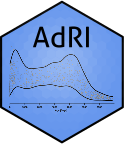
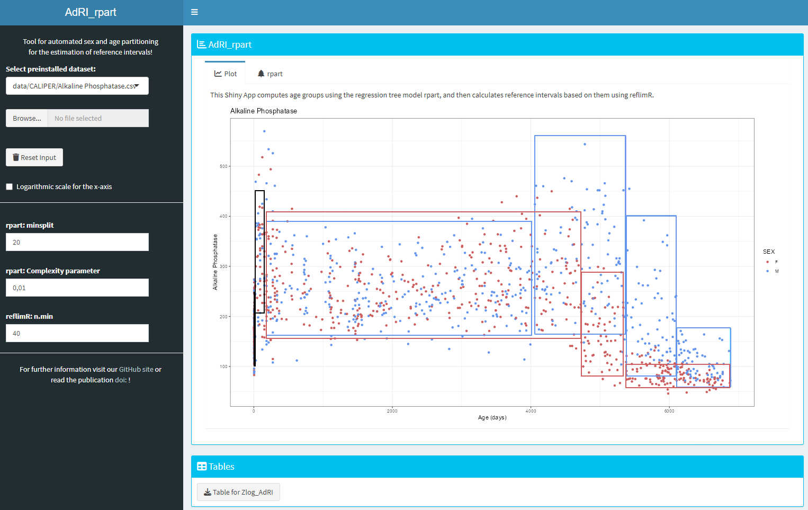

# Shiny App for "Automated sex and age partitioning for the estimation of reference intervals using a regression tree model."




This Shiny App computes age groups using the regression tree model based on the R package [rpart](https://cran.r-project.org/web/packages/rpart/index.html), and then calculates reference intervals based on them using [reflimR](https://cran.r-project.org/web/packages/reflimR/index.html).

Decision Trees are used for machine learning. They can be used for classification (_supervised learning_), but also for clustering (_unsupervised learning_). In the Shiny App the Decision Tree is used as a tool to separate the data into age-groups. The proposed age groups from the Decision Tree are used to calculate the reference intervals.

## Installation 

**Method 1:**
Use the function ```runGitHub()``` from the package [shiny](https://cran.r-project.org/web/packages/shiny/index.html):

```bash
if("shiny" %in% rownames(installed.packages())){
  library(shiny)} else{install.packages("shiny")
  library(shiny)}
runGitHub("AdRI_rpart", "SandraKla")
```

**Method 2** (not recommended):
Download the Zip-File from this Shiny App. Unzip the file and set your working direction to the path of the folder. 
The package [shiny](https://cran.r-project.org/web/packages/shiny/index.html) (≥ 1.7.1) must be installed before using the Shiny App:

```bash
# Test if shiny is installed:
if("shiny" %in% rownames(installed.packages())){
  library(shiny)} else{install.packages("shiny")
  library(shiny)}
```
And then start the app with the following code:
```bash
runApp("app.R")
```



The package [dplyr](https://cran.r-project.org/web/packages/dplyr/index.html) (≥ 1.1.3), [ggplot2](https://cran.r-project.org/web/packages/ggplot2/index.html) (≥ 3.4.4), [rpart](https://cran.r-project.org/web/packages/rpart/index.html) (≥ 4.1.21), [rpart.plot](https://cran.r-project.org/web/packages/rpart.plot/index.html) (≥ 3.1.1), [reflimR](https://cran.r-project.org/web/packages/reflimR/index.html) (≥ 1.0.6) and [shinydashboard](https://cran.r-project.org/web/packages/shinydashboard/index.html) (≥ 0.7.2) is downloaded or imported when starting this app. The used [R](https://www.r-project.org)-Version must be ≥ 4.3.2 (2023-10-31 ucrt).

## Usage

On the left side, you can use the sidebar to choose the lab parameters. In the main panel, you will see the corresponding plot and the outputs.

The data can be downloaded in a suitable form for the Shiny app [Zlog_AdRI](https://github.com/SandraKla/Zlog_AdRI).

### Preloaded dataset

The biomarker data from the [CALIPER study](https://doi.org/10.1373/clinchem.2011.177741) is available in this Shiny App in the [CALIPER folder](https://github.com/SandraKla/AdRI_rpart/tree/main/data). The data was brought into the appropriate format for the analysis.

* Albumin G (g/L)
* Albumin P (g/L)
* Alkaline Phosphatase (U/L)
* ALT (ACT) (U/L)
* ALT (U/L)
* Amylase (U/L)
* Apo A1 (g/L)
* Apo B (g/L)
* ASO (IU/mL)
* AST (ACT) (U/L)
* AST (U/L)
* Bilirubin Direct (µmol/L)
* Bilirubin-Total (T) (µmol/L)
* C3 (g/L)
* C4 (g/L)
* Calcium (mmol/L)
* ChE (U/L)
* Cholesterol (mmol/L)
* CO2 (carbon dioxide) (mmol/L)
* Creatinine (enzymatic) (μmol/L)
* Creatinine (Jaffe) (μmol/L)
* CRP (mg/L)
* GGT (U/L)
* Haptoglobin (g/L)
* IgA (g/L)
* IgG (g/L)
* IgM (g/L)
* Iron (μmol/L)
* LDH (LD) (U/L)
* Lipase (lip) (U/L)
* Magnesium (mmol/L)
* Phosphorus (mmol/L)
* Prealbumin (g/L)
* RF (rheumatoid factor) (IU/mL)
* Total Protein (g/L)
* Transferrin (TRF) (g/L)
* Triglyceride (mmol/L)
* UHDL (Ultra HDL) (mmol/L)
* Urea (mmol/L)
* Uric Acid (µmol/L)

New data is loaded with `read.csv2()` and the tables are written with `write.csv2()`. The CSV file has a semicolon as separator. The data must contain the following information: **SEX** ("F" = female, "M" = male), **AGE_DAYS** (age in days), **AGE_YEARS** (age in years), **VALUE** (value of the analyte) and **ANALYTE** (name of the analyte):

```bash
SEX;AGE_DAYS;AGE_YEARS;VALUE;ANALYTE
M;2;0;1;EXAMPLE
F;2;0;2;EXAMPLE
F;3;0;;EXAMPLE
F;3;0;1;EXAMPLE
M;3;0;2;EXAMPLE
```

## Contact

You are welcome to:
- Submit suggestions and Bugs at: https://github.com/SandraKla/AdRI_rpart/issues
- Make a pull request on: https://github.com/SandraKla/AdRI_rpart/pulls
- Write an Email with any questions and problems to: s.klawitter@ostfalia.de

Link to the publication: [Automated sex and age partitioning for the estimation of reference intervals using a regression tree model](https://doi.org/10.1515/labmed-2024-0083)
